# Supernova: A Quantum-Resistant, Carbon-Negative Blockchain

<div align="center">

  <p>
    <h2><strong>Supernova is a blockchain engineered from first principles to be quantum-resistant, environmentally sustainable, and scalable for a global financial system.</strong></h2>
  </p>

  <p align="center">
    <a href="https://supernovanetwork.xyz/"></a>
    <a href="https://github.com/Carbon-Twelve-C12/supernova/graphs/contributors"></a>
    <a href="https://github.com/Carbon-Twelve-C12/supernova/stargazers"></a>
    <a href="https://github.com/Carbon-Twelve-C12/supernova/releases"></a>
     <a href="https://deepwiki.com/Carbon-Twelve-C12/supernova"></a>
  </p>
</div>

## The Inevitable Future of a Quantum-Secure Economy

The entire $2.5 trillion cryptocurrency market is built on a cryptographic assumption with a known expiration date. The arrival of quantum computers is not an "if" but a "when" event, posing an existential threat to all existing digital assets.

**Supernova is a blockchain built for this new reality.** We are not a patch on a legacy system; we are a complete, from-first-principles reinvention of what a blockchain must be to survive the next 50 years. While others are debating the timeline of the quantum threat, we have already shipped the solution.

---

## Key Innovations

### 1. **End-to-End Quantum Resistance**
Our most durable competitive advantage is a deep, architectural commitment to post-quantum security. This is not a surface-level feature.
-   **Primary Signatures:** **ML-DSA (Dilithium)**, a NIST-standardized lattice-based scheme.
-   **Stateless Signatures:** **SPHINCS+** for high-security applications.
-   **Key Exchange:** **ML-KEM (Kyber)** for all P2P channel encryption.
-   **Hashing:** **SHA3-512** for Grover's algorithm resistance.

### 2. **A Quantum-Resistant Lightning Network**
We have rebuilt the Lightning Network from the ground up with post-quantum cryptography, securing the most vulnerable part of a scaling blockchain.
-   **Quantum Channels:** All funding and commitment transactions are signed with Dilithium.
-   **Quantum-Safe HTLCs:** Atomic swaps are protected with post-quantum signatures.
-   **Quantum Onion Routing:** Post-quantum KEM for layer encryption ensures payment privacy.

### 3. **Quantum Canary: A Proactive Early-Warning System**
We operate on the assumption of eventual attack. Our "Quantum Canary" system deploys intentionally weakened cryptographic keys as a honeypot. Any attempt to break them will trigger an automated, network-wide security upgrade long before the main network is threatened.

### 4. **Carbon-Negative Proof-of-Work**
We have solved PoW's environmental problem without sacrificing its proven security. An on-chain **Environmental Treasury** automatically purchases and retires carbon credits, funded by a portion of transaction fees, making the network verifiably carbon-negative.

---

## Architecture Overview

```mermaid
graph TD
    A[Supernova Blockchain] --> B[Quantum-Resistant Components]
    
    B --> C[Quantum Signatures]
    C --> C1[Dilithium - Primary]
    C --> C2[Falcon - Alternative]
    C --> C3[SPHINCS+ - Stateless]
    
    B --> D[Quantum Key Exchange]
    D --> D1[Kyber KEM]
    D --> D2[Post-Quantum TLS]
    
    B --> E[Quantum Wallets]
    E --> E1[HD Derivation with SHA3-512]
    E --> E2[Argon2 Key Derivation]
    E --> E3[Zero-Knowledge Proofs]
    
    B --> F[Quantum Lightning]
    F --> F1[Quantum HTLCs]
    F --> F2[Quantum Onion Routing]
    F --> F3[Quantum Watchtowers]
    
    B --> G[Quantum P2P]
    G --> G1[Quantum Handshakes]
    G --> G2[Quantum Message Encryption]
    G --> G3[Key Rotation]
    
    B --> H[Quantum Canary System]
    H --> H1[Early Warning Detection]
    H --> H2[Automatic Migration]
    H --> H3[Network-wide Alerts]
    
    style A fill:#f9f,stroke:#333,stroke-width:4px
    style B fill:#bbf,stroke:#333,stroke-width:2px
    style C fill:#9f9,stroke:#333,stroke-width:2px
    style D fill:#9f9,stroke:#333,stroke-width:2px
    style E fill:#9f9,stroke:#333,stroke-width:2px
    style F fill:#9f9,stroke:#333,stroke-width:2px
    style G fill:#9f9,stroke:#333,stroke-width:2px
    style H fill:#ff9,stroke:#333,stroke-width:2px
```



---

## Getting Started

### Quick Testnet Deployment
Deploy your own Supernova testnet in under 30 minutes:
```bash
# One-line deployment on Ubuntu VPS
curl -sSL https://raw.githubusercontent.com/Carbon-Twelve-C12/supernova/main/deployment/scripts/deploy-testnet.sh | \
  DOMAIN=testnet.yourdomain.com \
  EMAIL=your-email@example.com \
  bash
```

### Build from Source
```bash
# Clone the repository
git clone https://github.com/Carbon-Twelve-C12/supernova.git
cd supernova

# Build the entire workspace
cargo build --release --all-features

# Run the test suite
cargo test --workspace --release

# Run the node
./target/release/supernova-node --network testnet
```

---

## Current Status
**Version: 2.0.0-QR1** (Quantum-Resistant 1)

The core quantum cryptography infrastructure is complete and compiling. We are now in the final phase of integration and testing before the public testnet launch.

- **Core Blockchain**: ✅ 100% complete
- **Quantum Cryptography**: ✅ 100% implemented
- **Lightning Network (Quantum)**: ✅ 100% implemented
- **Node Integration**: ✅ 100% complete

---

## Contributing

We are building the future of secure, decentralized finance. Join us.

1.  **Test the network**: Help us find bugs and improve performance.
2.  **Audit the code**: We welcome security reviews from the community.
3.  **Build on Supernova**: Create the first generation of quantum-resistant dApps.

See [CONTRIBUTING.md](CONTRIBUTING.md) for guidelines.

## License

Supernova is licensed under the MIT License. See [LICENSE](LICENSE) for details.