# Supernova: A Quantum-Resistant, Carbon-Negative Blockchain

**Last Updated**: October 21st, 2025

<div align="center">
  <p>
    <h2><strong>Supernova is a PoW blockchain engineered from first principles to be quantum-resistant, environmentally sustainable, and scalable for a next-generation global financial system.</strong></h2>
  </p>
  <p align="center">
    <a href="https://supernovanetwork.xyz/"></a>
    <a href="https://github.com/Carbon-Twelve-C12/supernova/graphs/contributors"></a>
    <a href="https://github.com/Carbon-Twelve-C12/supernova/stargazers"></a>
    <a href="https://github.com/Carbon-Twelve-C12/supernova/releases"></a>
     <a href="https://deepwiki.com/Carbon-Twelve-C12/supernova"></a>
  </p>
</div>

## Overview

Supernova is a production-grade Proof-of-Work blockchain written in Rust. It is designed to address three of the most significant challenges facing the blockchain industry: the existential threat of quantum computing, the environmental impact of PoW consensus, and the demand for scalable, low-cost transactions. Built with a security-first approach, Supernova implements comprehensive security testing to ensure unparalleled reliability.

For a more detailed breakdown of the project's status, architecture, and goals, please see the [Supernova Overview](docs/supernova_overview.md) document.

Our primary goal is to provide a secure, scalable, and sustainable platform for the next generation of decentralized applications. 

---

## Key Innovations

### 1. **End-to-End Quantum Resistance**
Supernova is engineered with an architectural commitment to post-quantum security. We have replaced classical cryptographic primitives (ECDSA, secp256k1) with NIST-standardized post-quantum schemes across the entire protocol stack.
-   **Primary Signatures:** **ML-DSA (Dilithium)** for general on-chain transactions.
-   **Stateless Signatures:** **SPHINCS+** for high-security applications like wallet recovery.
-   **Key Exchange:** **ML-KEM (Kyber)** for securing the P2P communication layer.
-   **Hashing:** **SHA3-512** for resistance against Grover's algorithm.

### 2. **A Quantum-Resistant Lightning Network**
We have implemented a Lightning Network that is quantum-secure by design, addressing a critical vulnerability in second-layer scaling solutions.
-   **Quantum Channels:** All channel operations (funding, commitment, and closing transactions) are secured with Dilithium signatures.
-   **Quantum-Safe HTLCs:** Hash Time-Locked Contracts use SHA3-512 hashes, ensuring that payments are secure even from quantum adversaries.
-   **Quantum Onion Routing:** Payment privacy is protected using a post-quantum Key Encapsulation Mechanism (KEM) for layer encryption.

### 3. **Carbon-Negative Proof-of-Work**
Supernova's PoW consensus mechanism is designed to be environmentally sustainable.
-   **Real-Time Emissions Tracking:** An on-chain system tracks the carbon footprint of mining operations in real-time.
-   **Green Mining Incentives:** Miners who use verified renewable energy sources receive a block reward bonus, creating an economic incentive for sustainable practices.
-   **Environmental Treasury:** A portion of transaction fees is automatically allocated to a decentralized treasury that funds carbon offset projects.

---

## Architecture Overview

```mermaid
graph TD
    A[Supernova Blockchain] --> B[Quantum-Resistant Components]
    
    B --> C[Quantum Signatures]
    C --> C1[Dilithium - Primary]
    C --> C2[Falcon - Alternative]
    C --> C3[SPHINCS+ - Stateless]
    
    B --> D[Quantum Key Exchange]
    D --> D1[Kyber KEM]
    D --> D2[Post-Quantum TLS]
    
    B --> E[Quantum Wallets]
    E --> E1[HD Derivation with SHA3-512]
    E --> E2[Argon2 Key Derivation]
    E --> E3[Zero-Knowledge Proofs]
    
    B --> F[Quantum Lightning]
    F --> F1[Quantum HTLCs]
    F --> F2[Quantum Onion Routing]
    F --> F3[Quantum Watchtowers]
    
    B --> G[Quantum P2P]
    G --> G1[Quantum Handshakes]
    G --> G2[Quantum Message Encryption]
    G --> G3[Key Rotation]
    
    B --> H[Quantum Canary System]
    H --> H1[Early Warning Detection]
    H --> H2[Automatic Migration]
    H --> H3[Network-wide Alerts]
    
    style A fill:#f9f,stroke:#333,stroke-width:4px
    style B fill:#bbf,stroke:#333,stroke-width:2px
    style C fill:#9f9,stroke:#333,stroke-width:2px
    style D fill:#9f9,stroke:#333,stroke-width:2px
    style E fill:#9f9,stroke:#333,stroke-width:2px
    style F fill:#9f9,stroke:#333,stroke-width:2px
    style G fill:#9f9,stroke:#333,stroke-width:2px
    style H fill:#ff9,stroke:#333,stroke-width:2px
```



> **Note**: This diagram focuses on Supernova's quantum-resistant components. For a comprehensive view of the entire system architecture including data flows, environmental systems, and component dependencies, see the [Architecture Overview](docs/supernova_overview.md#architecture-overview) in our detailed documentation.

---

## Getting Started

### Quick Testnet Deployment
Deploy your own Supernova testnet in under 30 minutes:
```bash
# One-line deployment on Ubuntu VPS
curl -sSL https://raw.githubusercontent.com/Carbon-Twelve-C12/supernova/main/deployment/scripts/deploy-testnet.sh | \
  DOMAIN=testnet.yourdomain.com \
  EMAIL=your-email@example.com \
  bash
```

### Build from Source
```bash
# Clone the repository
git clone https://github.com/Carbon-Twelve-C12/supernova.git
cd supernova

# Build the entire workspace
cargo build --release --all-features

# Run the test suite
cargo test --workspace --release

# Run the node
./target/release/supernova-node --network testnet
```

---

## Current Status
**Version: 1.0.0-RC4** (Release Candidate 4)

The core quantum cryptography infrastructure is complete and production-ready. Recent security hardening has eliminated all critical and high-priority vulnerabilities, with 131 comprehensive security tests added.

- **Core Blockchain**: 100% complete
- **Quantum Cryptography**: 100% implemented
- **Lightning Network (Quantum)**: 100% implemented
- **Node Integration**: 100% complete
- **Security Hardening**: Critical (P0) and High-Priority (P1) fixes complete
- **Test Coverage**: 96% achieved (up from 94%)

**Atomic Swap Progress:**
- **Phase 1**: Core HTLC Implementation - Complete
- **Phase 2**: Cross-Chain Monitoring - Complete  
- **Phase 3**: API and CLI Integration - Complete
- **Phase 4**: Privacy Features (Confidential & ZK Swaps) - Complete
- **Phase 5**: Testing and Security - Complete
- **Phase 6**: Performance and Monitoring - Complete

The atomic swap implementation is now fully complete with:
- Comprehensive caching layer for optimal performance
- Full Prometheus metrics integration for monitoring
- Grafana dashboard configuration for visualization
- Performance optimizations across all critical paths

## 🔒 Security

Supernova implements defense-in-depth security practices with recent comprehensive hardening:

### **Security Hardening Complete**
- **10 critical and high-priority vulnerabilities eliminated** (3 P0, 7 P1)
- **131 security tests added** covering consensus, cryptography, networking, and storage
- **96% test coverage** across the codebase (up from 94%)
- **Zero `unwrap()` calls** in all security-critical paths

### **Vulnerabilities Fixed**
**Critical (P0)**:
- Consensus fork resolution race conditions
- UTXO double-spend prevention
- Quantum signature algorithm downgrade attacks

**High-Priority (P1)**:
- Lightning HTLC quantum timeout exploitation
- Environmental oracle Byzantine consensus weakness
- Mempool denial-of-service flooding
- Network eclipse attack vectors
- Block validation complexity attacks
- Wallet HD key derivation predictability
- Storage corruption recovery validation

### **Security Testing**
- Comprehensive attack scenario testing
- 100-thread stress tests for concurrency safety
- Fuzzing infrastructure with AFL++
- Integration tests for multi-component security

### **Quantum-First Security Design**
- Post-quantum cryptography at every layer
- Algorithm downgrade prevention
- Quantum signature timeout buffers
- Quantum HD wallet key derivation

---

## Contributing

We are building the future of secure, decentralized finance. Join us.

1.  **Test the network**: Help us find bugs and improve performance.
2.  **Audit the code**: We welcome security reviews from the community.
3.  **Build on Supernova**: Create the first generation of quantum-resistant dApps.

See [CONTRIBUTING.md](CONTRIBUTING.md) for guidelines.

## License

Supernova is licensed under the MIT License. See [LICENSE](LICENSE) for details. 